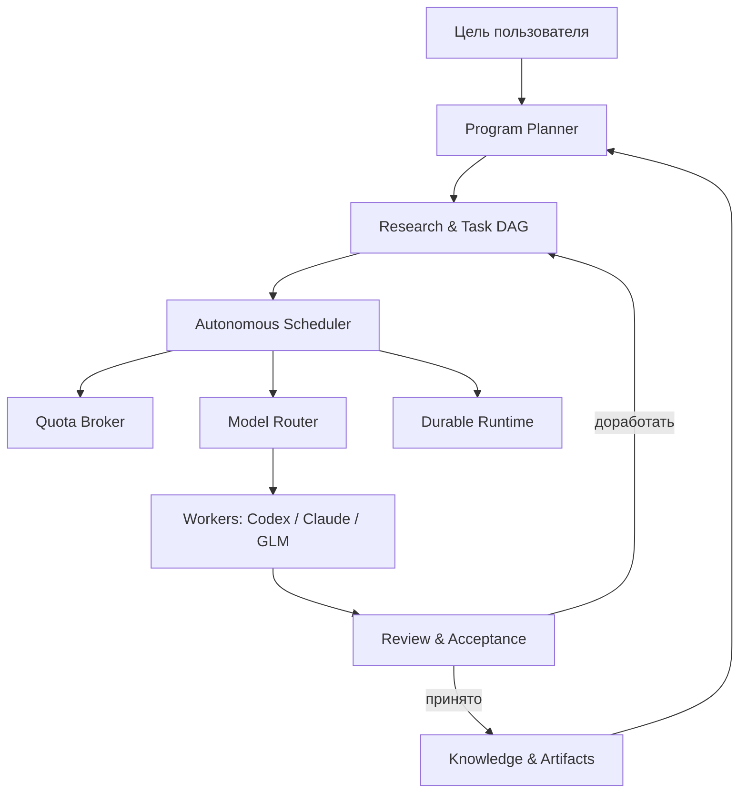

# Intelligence Researcher

> Концепция quota-aware автономного оркестратора для длительных исследований и разработки с несколькими LLM и агентными CLI.

## Идея

Современные coding-агенты хорошо решают отдельные задачи, но плохо управляют исследованием, которое длится недели или месяцы. Их сессии заканчиваются, контекст разрастается, квоты разных моделей сбрасываются в разное время, а после сбоя нередко требуется человек.

**Intelligence Researcher** задуман как управляющий слой над Codex, Claude Code, GLM и другими исполнителями. Пользователь задаёт цель уровня проекта, а система:

- превращает цель в исследовательскую программу и ориентированный ациклический граф задач (DAG);
- выбирает модель по сложности, цене, доступной квоте и роли задачи;
- использует сильные модели для планирования, синтеза и ревью;
- отдаёт массовую и хорошо формализованную работу более дешёвым моделям;
- автоматически повышает класс модели после неудачных попыток;
- ждёт восстановления лимита и затем продолжает работу;
- перед сбросом квоты направляет невостребованный дорогой ресурс на полезный backlog;
- сохраняет знания, решения, эксперименты и отрицательные результаты в репозитории;
- переживает перезапуск процессов и продолжает workflow с контрольной точки.

Это не один «супер-агент». Это диспетчер, который управляет множеством короткоживущих агентов и хранит состояние вне их контекстных окон.

## Главный принцип

```text
Цель
  → Research Program
  → Workstreams
  → Investigations / Experiments
  → Evidence
  → Synthesis
  → решение: исследовать дальше / прототипировать / отклонить / реализовать
  → Implementation Plan
  → Execution + Review
```

Для маленькой понятной задачи можно сразу перейти к implementation plan. Для задачи масштаба «человеко-месяц» сначала строится адаптивная исследовательская программа: результаты каждого цикла меняют следующий цикл, поэтому гигантский неизменяемый план заранее не создаётся.

### Что здесь означает DAG

`DAG` (`Directed Acyclic Graph`) — ориентированный граф без циклов. Проще говоря, это не линейный список, а сеть задач с явными зависимостями:

```text
описать формат задачи ─┬→ реализовать scheduler ─→ интеграционный тест
                      └→ реализовать хранилище ──┘

описать worker API ────┬→ адаптер Codex ────────┐
                      └→ адаптер Claude ────────┴→ интеграционный тест
```

Стрелка означает «эта задача нужна следующей». Независимые ветки можно выполнять параллельно; если одна модель ждёт сброса лимита, scheduler берёт готовую задачу из другой ветки.

Слово `acyclic` означает, что задача не может через цепочку зависеть сама от себя. Само исследование при этом может возвращаться к прежнему вопросу: после synthesis создаётся новая версия вопроса или новая задача, а не цикл внутри одной версии графа.

## Архитектура в одном рисунке



Предполагаемые слои:

1. **Intelligence** — LLM для планирования, исследования, синтеза и ревью.
2. **Orchestration** — scheduler, DAG, model router, quota broker, policies.
3. **Durable runtime** — долговечные workflow, таймеры, повторы и восстановление.
4. **Execution** — CLI/API/MCP-адаптеры, изолированные worktree, тесты и эксперименты.
5. **Memory** — Git, БД состояния, evidence и воспроизводимые артефакты.

## Модели — рабочие станки, scheduler — начальник цеха

| Уровень | Типичные исполнители | Работа |
|---|---|---|
| S | Astra max/xhigh, сильнейшие reasoning-модели | программа исследования, архитектура, synthesis, adversarial/final review |
| A | Claude Opus/Sonnet, Sol и аналоги | локальное планирование, сложный код, глубокие исследования |
| B | Terra, сильные GLM и аналоги | обычная реализация, анализ репозиториев, исправления |
| C | Luna, дешёвые GLM и аналоги | извлечение фактов, классификация, тесты, документация, массовые проверки |

Конкретные названия моделей — конфигурация, а не часть ядра. Задача описывает необходимые способности и минимальный tier; окончательный выбор делает scheduler.

## Quota-aware планирование

У провайдеров разные пятичасовые, недельные, денежные и связанные между продуктами лимиты. `Quota Broker` должен хранить наблюдаемое состояние каждого quota pool, прогноз расхода и время следующей доступности.

Если дорогая модель временно исчерпана, workflow не падает: задача ставится на паузу до reset, а scheduler продолжает независимые задачи на других моделях. Если reset близко, а значительная квота скоро сгорит, включается `quota harvesting`: из неблокирующего backlog выбираются интеллектуально ценные задачи, где сильная модель даст наибольший прирост качества.

Примеры такого backlog:

- попытаться опровергнуть принятую архитектуру;
- независимо пересмотреть выводы последних циклов;
- проверить скрытые допущения;
- исследовать альтернативный IR или алгоритм;
- прогнать решение на более сложном корпусе;
- вернуться к второстепенным репозиториям и источникам.

`Quota harvesting` не означает обход ограничений: система работает только через разрешённые интерфейсы, соблюдает rate limits и условия провайдеров.

## Память проекта

Долговременная память находится не в истории чата, а в Git и структурированных артефактах. Каждый investigation обязан оставить воспроизводимый результат:

```text
question
scope
sources
repositories_examined
code_inspected
experiments_performed
results
failed_approaches
confidence
open_questions
recommendations
artifacts
```

Новый агент должен суметь продолжить работу по этим файлам, не читая старую беседу.

## Связь с существующими инструментами

- **Superpowers** полезен ниже уровня программы: brainstorming → spec → implementation plan → execution/review.
- **repo-evaluation skills** используются как специализированные исполнители для систематического обзора репозиториев.
- **Codex / Claude Code / другие CLI** являются заменяемыми worker-адаптерами.
- **Temporal** рассматривается как кандидат на durable execution; **PostgreSQL** — на хранение оперативного состояния.
- **Git worktrees** дают изоляцию параллельным программным задачам.

## Текущий статус разработки

Сейчас мы **создаём сам инструмент**. Оркестратор ещё не работает и автономные исследования пока не запускает. Текущая фаза — уточнить архитектуру и контракты, затем реализовать минимальный работающий MVP: хранилище состояния, scheduler, единый интерфейс worker-ов, первые два адаптера, review и восстановление после сбоя.

### Первый проверочный сценарий MVP

Когда этот минимальный инструмент будет собран, его нужно проверить на небольшом искусственно ограниченном исследовании. В этом тесте уже созданный MVP должен:

1. принять одну тестовую исследовательскую цель;
2. построить или загрузить небольшой DAG;
3. запустить двух разных исполнителей;
4. проверить и сохранить их результаты;
5. пережить искусственный сбой и ожидание квоты.

Это **не текущий рабочий режим проекта**, а будущий end-to-end тест, доказывающий, что первая версия инструмента действительно работает.

## Документы

- [Видение и границы](docs/vision.md)
- [Исследовательский процесс](docs/research-process.md)
- [Архитектура](docs/architecture.md)
- [Модель задач и состояния](docs/task-model.md)
- [Маршрутизация моделей и квоты](docs/model-routing-and-quotas.md)
- [Надёжность и выполнение 24/7](docs/durable-execution.md)
- [Артефакты и память проекта](docs/artifacts-and-memory.md)
- [Дорожная карта](docs/roadmap.md)
- [Открытые вопросы](docs/open-questions.md)
- [Термины](docs/terminology.md)

## Рабочее название

`Intelligence Researcher` пока является рабочим названием. Проект шире обычного research assistant: он соединяет управление исследовательской программой, разработку, квоты и надёжное выполнение.
