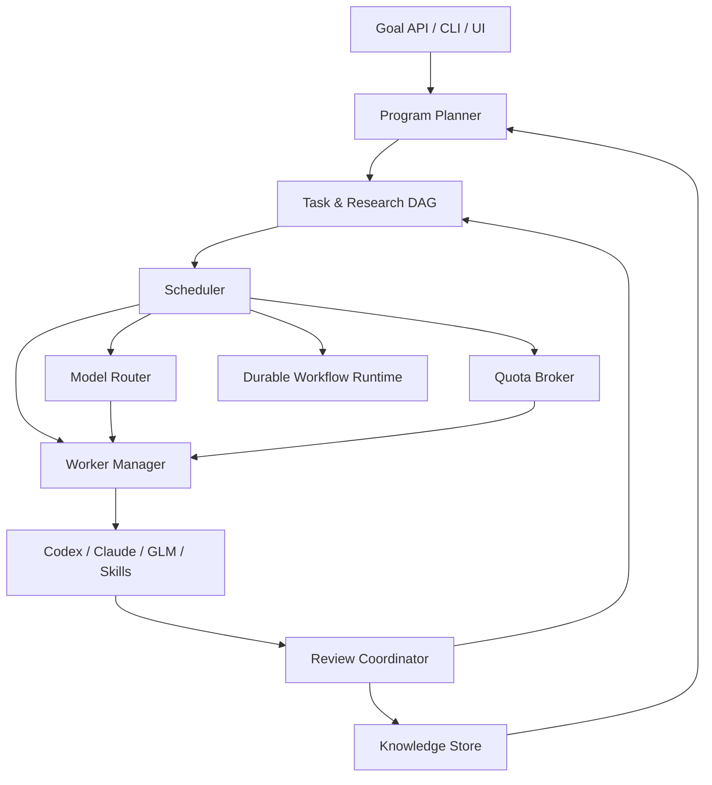

# Архитектура

## Общая схема



## Разделение ответственности

### Program Planner

LLM-компонент высокого уровня. Преобразует цель в research questions, workstreams и начальный DAG; на synthesis checkpoint предлагает обновление программы. Planner не управляет процессами, таймерами и квотами напрямую.

### DAG Store

Авторитетное состояние задач и зависимостей:

- task definitions и версии;
- статусы и попытки;
- dependency edges;
- блокировки и leases;
- acceptance criteria;
- связи с findings, decisions и artifacts.

### Scheduler

Детерминированный управляющий слой. Он:

- находит runnable-задачи;
- учитывает critical path и приоритеты;
- применяет политики параллелизма;
- просит Router выбрать подходящего исполнителя;
- резервирует quota pool;
- создаёт lease;
- обрабатывает success, failure, timeout и quota wait;
- запускает synthesis/replanning по правилам.

Scheduler не должен свободно «рассуждать» текстом. Неопределённый выбор оформляется отдельной задачей для planner/reviewer, а принятое решение возвращается как структурированные данные.

### Model Router

Сопоставляет требования задачи с профилями доступных моделей:

- reasoning tier;
- coding/tool-use capabilities;
- размер контекста;
- поддержка нужного CLI/API;
- ожидаемая надёжность для данного типа задач;
- latency и денежная стоимость;
- доступная квота;
- история успехов на похожих заданиях.

### Quota Broker

Представляет лимиты как связанные `quota pools`, а не как поле у модели. Несколько моделей или интерфейсов могут расходовать общий пул. Broker хранит наблюдаемое состояние, reset time, confidence и reservations.

### Worker Manager

Запускает изолированного исполнителя и обеспечивает единый контракт:

```text
prepare context pack
reserve workspace/worktree
start process
stream events
heartbeat
collect artifacts
normalize result
cleanup or quarantine
```

Worker-адаптеры должны скрывать различия `codex exec`, `claude -p`, API, MCP и локальных моделей.

### Review Coordinator

Выбирает режим проверки:

- детерминированные тесты;
- schema validation;
- повтор эксперимента;
- LLM review другого tier/семейства;
- adversarial review;
- human approval.

Он принимает результат только при выполнении acceptance criteria. Review — отдельная задача с собственной стоимостью и evidence.

### Knowledge Store

Хранит долговечные артефакты проекта: research plan, findings, decisions, synthesis, отчёты экспериментов, коммиты, патчи и ссылки на исходные данные.

### Durable Workflow Runtime

Отвечает за сохранённые таймеры, retries, signals и восстановление после сбоя. Кандидат — Temporal; MVP может начать с PostgreSQL и явной state machine, если семантика восстановления заранее определена.

## Где хранить данные

| Данные | Предпочтительное место |
|---|---|
| Текущее состояние задач, leases, таймеры | PostgreSQL / durable runtime |
| Версионируемые планы, findings, decisions | Git |
| Большие логи, корпуса, бинарные artifacts | Object storage с content hash |
| Секреты провайдеров | Secret manager / системное хранилище |
| Телеметрия и метрики | Observability backend |

Git не должен использоваться как высокочастотная очередь, а БД — как единственное место для итоговых знаний.

## Поток одного задания

1. Scheduler выбирает runnable task.
2. Router формирует ранжированный список исполнителей.
3. Quota Broker подтверждает доступность или возвращает `available_at`.
4. Worker Manager создаёт lease и изолированное рабочее пространство.
5. Adapter запускает модель с минимальным context pack.
6. События и heartbeat сохраняются.
7. Результат нормализуется и отправляется на review.
8. После acceptance артефакты коммитятся, зависимости разблокируются.
9. При reject создаётся retry/revision либо повышается tier.
10. При quota exhaustion задача засыпает до reset, а scheduler выбирает другую.

## Событийная модель

Полезные доменные события:

```text
GoalAccepted
ProgramPlanned
TaskBecameRunnable
QuotaReserved
WorkerStarted
HeartbeatReceived
ArtifactProduced
TaskFailed
QuotaExhausted
ReviewRejected
TaskAccepted
SynthesisRequested
ProgramRevised
```

События упрощают аудит, восстановление и объяснение решений scheduler.

## Границы MVP

Первый прототип не требует Kubernetes, множества машин и сложного UI. Достаточно:

- одного scheduler-процесса;
- PostgreSQL или SQLite для прототипа с чёткой миграцией на PostgreSQL;
- двух worker-адаптеров;
- Git-репозитория артефактов;
- простого CLI/dashboard статуса;
- сохранённых retry timers;
- ручного ввода квот плюс распознавания quota errors.

Сложность следует добавлять после вертикального сценария, а не до него.
