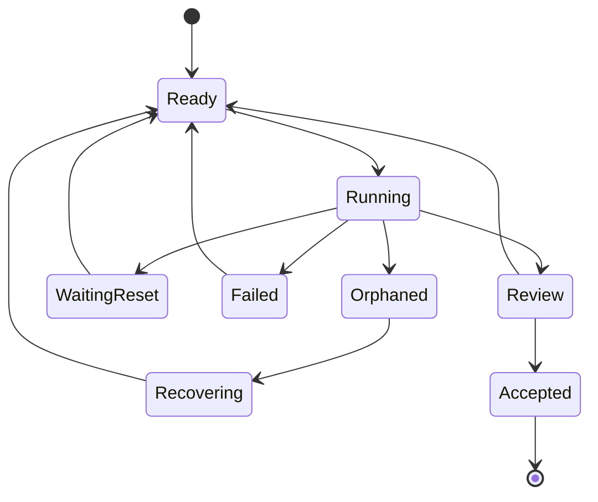

# Надёжность и выполнение 24/7

## Что означает 24/7

Не бесконечную LLM-сессию и не `while true`, а workflow, который может месяцами находиться в состояниях работы, ожидания и восстановления, не теряя прогресс.

Типичные сбои:

- worker или CLI завис;
- процесс завершился без финального сообщения;
- остался git lock;
- OAuth/токен истёк;
- сеть, VPN, VPS или MCP недоступны;
- тест завис;
- машина перезагрузилась;
- provider вернул quota/rate limit;
- ветка изменилась конкурентно;
- результат создан, но подтверждение потерялось.

## Durable state machine



Каждый переход сохраняется до запуска побочного эффекта или вместе с ним по безопасному протоколу. После рестарта scheduler восстанавливает runnable timers и просроченные leases.

## Temporal или собственный runtime

Temporal привлекателен тем, что уже решает:

- durable timers;
- retries и backoff;
- workflow history;
- signals и human approval;
- восстановление после падения worker process;
- долгоживущие workflows.

Но он добавляет операционную сложность. Для MVP допустима явная state machine в PostgreSQL при выполнении условий:

- транзакционные переходы;
- outbox/inbox для внешних событий;
- leases с TTL;
- отдельный timer poller;
- идемпотентные activities;
- аудит истории.

Решение о Temporal следует принять после вертикального прототипа, а не по моде.

## Lease, heartbeat, timeout

Каждый attempt получает:

```text
lease_id
worker_id
acquired_at
expires_at
heartbeat_interval
last_heartbeat_at
soft_timeout
hard_timeout
checkpoint_location
```

Если lease истёк:

1. attempt становится `orphaned`;
2. watchdog проверяет жив ли процесс;
3. найденные artifacts помещаются в quarantine;
4. определяется последняя безопасная checkpoint;
5. задача возобновляется или повторяется.

## Checkpoints

Checkpoint зависит от типа задачи:

- research: список уже обработанных источников и черновые evidence records;
- repository evaluation: commit SHA кандидата, выполненные проверки, результаты команд;
- coding: worktree, commit, tests run, unresolved failures;
- synthesis: набор входных artifact IDs и версия draft.

Продолжение должно быть возможно новой сессией и даже другой моделью.

## Идемпотентность и семантика доставки

Exactly-once для внешних систем обычно недостижим. Система проектируется как at-least-once с idempotency keys.

Примеры:

- commit создаётся только для конкретного attempt ID;
- повторная публикация artifact с тем же content hash возвращает существующий ID;
- side effect записывается в outbox;
- перед созданием PR проверяется marker/task ID;
- завершение attempt не разблокирует зависимости дважды.

## Git и worktrees

Каждая coding-задача получает отдельную ветку/worktree. Worker не работает в общем mutable checkout.

Жизненный цикл:

```text
allocate worktree
→ record base SHA
→ run worker
→ tests
→ review
→ commit
→ integrate/rebase policy
→ remove worktree after retention window
```

При конфликте создаётся отдельная integration task. Нельзя автоматически force-push общую ветку.

## Watchdog

Watchdog независим от LLM и проверяет:

- просроченные leases;
- зависшие процессы;
- рост логов без heartbeat;
- мёртвые worktrees/locks;
- недоступные adapters;
- просроченные credentials;
- backlog durable timers;
- несогласованность task status и artifacts.

Он исправляет только заранее разрешённые случаи; остальное переводит в `needs_operator` с диагностикой.

## Наблюдаемость

Минимальный dashboard должен показывать:

- активные/ожидающие/заблокированные tasks;
- critical path;
- workers и heartbeat;
- quota pools и confidence;
- последние failures и retries;
- стоимость и расход по проекту;
- pending human decisions;
- provenance принятого результата.

Логи связываются через `goal_id`, `task_id`, `attempt_id`, `worker_id` и `artifact_id`.

## Безопасность

- секреты не попадают в prompts, логи и Git;
- worker получает минимальные временные права;
- network/filesystem permissions задаются на task;
- внешние writes требуют явной policy;
- подозрительные artifacts не исполняются автоматически;
- provider adapters соблюдают официальные интерфейсы и условия использования;
- destructive operations имеют human gate и проверку точной цели.
