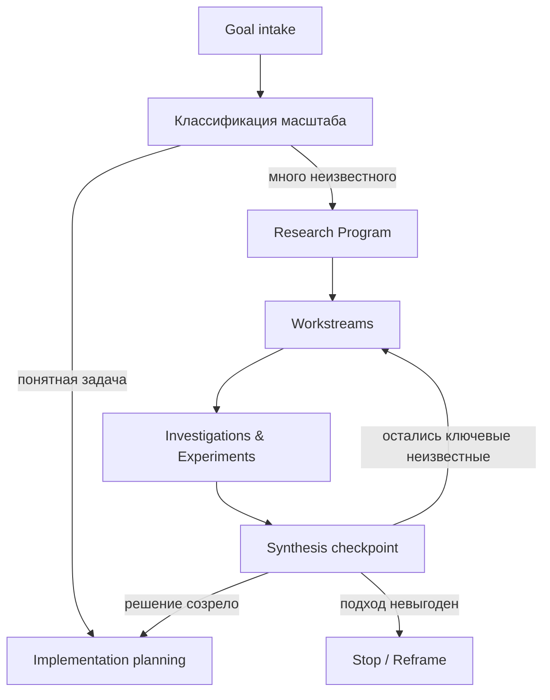

# Исследовательский процесс

## Почему implementation plan недостаточен

`brainstorming → spec → writing-plans → execution` хорошо работает, когда пространство решения уже понятно. Для исследования на человеко-месяц невозможно заранее честно выписать сотни точных шагов: первые результаты изменят последующие.

Поэтому перед implementation planning появляется отдельный уровень — **Research Program**.



## 0. Intake и triage

На входе фиксируются:

- желаемый результат и практическая ценность;
- что пользователь не хочет строить с нуля;
- ограничения по сроку, стоимости, технологиям, лицензиям и данным;
- известные кандидаты, репозитории и источники;
- критерий, по которому исследование можно остановить;
- риски и решения, требующие участия человека.

Planner оценивает:

- степень неопределённости;
- количество независимых направлений;
- наличие необратимых решений;
- ожидаемую длительность;
- возможность прямого implementation plan.

## 1. Исследовательские вопросы

Большая цель преобразуется в набор RQ (`Research Question`). Хороший RQ допускает проверяемый ответ и влияет на решение.

Пример:

```text
RQ1. Какие парсеры 1С 7.7 можно переиспользовать и на каких корпусах они проверялись?
RQ2. Какой semantic IR нужен между AST и моделью бизнес-логики?
RQ3. Как восстанавливать динамические вызовы с измеримой полнотой?
RQ4. Где LLM полезнее детерминированного анализа, а где создаёт непроверяемые догадки?
```

К каждому вопросу привязываются:

- значение для проекта;
- необходимые доказательства;
- зависимости;
- критерий достаточности ответа;
- текущая уверенность.

## 2. Workstreams

Связанные вопросы группируются в направления, например:

- Parsing;
- Semantic analysis;
- Intermediate Representation;
- Knowledge graph;
- Retrieval / RAG;
- Migration;
- Evaluation corpus;
- Operations.

Workstream — это не один вечный агент. Это контейнер целей, решений и множества ограниченных investigations.

## 3. Investigation и spike

Каждое исследование получает ограниченный вопрос и бюджет. Возможные типы:

- статический обзор репозиториев;
- чтение первичных источников;
- сравнительная оценка кандидатов;
- code archaeology;
- time-boxed spike;
- воспроизводимый эксперимент;
- adversarial review;
- benchmark;
- proof of concept.

Исполнитель обязан вернуть не эссе, а структурированный пакет: вопрос, метод, evidence, результаты, ограничения, уверенность, отрицательные результаты, открытые вопросы и ссылки на артефакты.

## 4. Review

Review проверяет не стилистику, а достаточность результата:

- отвечает ли работа на исходный вопрос;
- подтверждены ли факты источниками или экспериментами;
- воспроизводимы ли действия;
- отделены ли наблюдения от интерпретаций;
- указаны ли ограничения и альтернативные объяснения;
- выполнены ли acceptance criteria.

Сложный или стратегический результат может проходить независимое и adversarial review. Reviewer не должен автоматически доверять self-report исполнителя.

## 5. Synthesis checkpoint

Synthesis соединяет findings нескольких investigations и обновляет общую модель проекта.

На checkpoint фиксируется:

1. Что теперь считается установленным.
2. Что опровергнуто.
3. Какие предположения остаются неподтверждёнными.
4. Какие новые вопросы появились.
5. Какие зависимости и приоритеты изменились.
6. Какие design decisions можно принять.
7. Следующее действие: новый цикл, прототип, реализация, остановка или смена рамки.

Synthesis — работа сильной модели с обязательной проверкой ссылок на исходные artifacts. Он не должен превращать слабые findings в уверенное решение.

## 6. Переход к реализации

Когда критические неизвестные закрыты, конкретный кусок переводится в обычный инженерный цикл:

```text
validated finding
  → brainstorming / design
  → specification
  → implementation plan
  → isolated execution
  → tests
  → code review
  → integration
```

Именно здесь особенно полезны Superpowers и подобные skills. Они являются нижним уровнем процесса, а не заменой Research Program.

## Рекурсивность

Если investigation сам оказался слишком большим, его нельзя маскировать длинным prompt. Он превращается во вложенную research program со своими вопросами, workstreams и synthesis, сохраняя связь с родительской целью.

## Human checkpoints

Автономность не отменяет человека. Явное подтверждение требуется, когда:

- меняется цель или существенная граница проекта;
- нужно принять дорогую или необратимую архитектуру;
- требуется новый доступ, секрет или внешний расход;
- политика провайдера неясна;
- два правдоподобных направления имеют разные продуктовые последствия;
- уверенность остаётся низкой после разумного бюджета исследования.
