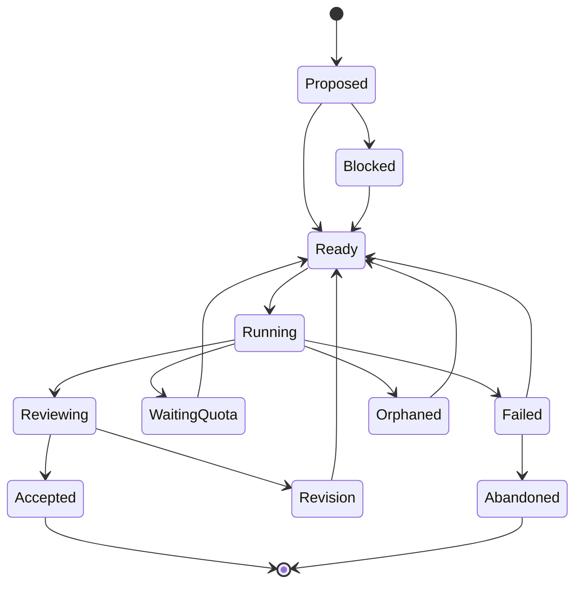

# Модель задач и состояний

## Почему DAG, а не список

Линейный список не показывает, какие исследования независимы, что блокирует решение и чем можно заняться во время ожидания квоты. Directed Acyclic Graph позволяет выделить critical path, безопасно распараллелить работу и иметь полезный backlog.

## Пример задачи

```yaml
id: IR-042
title: Сравнить варианты semantic IR
type: research
workstream: semantic-ir

objective: >
  Проверить три представления IR на способности сохранять семантику
  1С 7.7 и поддерживать последующее построение call graph.

priority: 55
difficulty: 9
risk: high
blocking: false
speculative: true
preemptible: true

depends_on:
  - PARSER-017
  - AST-031

required_capabilities:
  - architecture
  - static-analysis
  - long-context
min_model_tier: S
preferred_models:
  - astra-max
  - claude-opus

budget:
  max_attempts: 3
  max_wall_time: 6h
  max_cost_usd: 40

acceptance:
  - Сформулированы критерии сравнения
  - Каждый вариант проверен на одном общем корпусе
  - Указаны утраты семантики и ограничения
  - Артефакты эксперимента воспроизводимы

review:
  required: true
  mode: adversarial
  min_tier: S
  independence: different_model_family

outputs:
  - findings/IR-042.md
  - experiments/IR-042/
```

## Типы задач

- `planning` — декомпозиция цели или локальное перепланирование;
- `research` — ответ на вопрос с evidence;
- `evaluation` — систематическое сравнение кандидатов;
- `experiment` — воспроизводимая проверка гипотезы;
- `implementation` — изменение кода/конфигурации;
- `test` — проверка результата;
- `review` — независимая оценка;
- `synthesis` — соединение findings и обновление программы;
- `maintenance` — индексация, очистка, документация, обновление корпусов;
- `human_decision` — явная точка участия пользователя.

## Состояния



Дополнительные состояния могут включать `waiting_human`, `cancelled` и `superseded`. Причина перехода всегда сохраняется.

## Runnable-условие

Задача готова к запуску, если:

- все обязательные зависимости приняты;
- нет активного lease;
- не наступил deadline ожидания;
- доступен подходящий worker и quota pool;
- не превышен бюджет попыток/стоимости;
- отсутствует незакрытая human gate;
- артефакты входа существуют и прошли валидацию.

## Приоритет

Базовый приоритет задаёт программа, но scheduler вычисляет динамический score. Возможные составляющие:

```text
score =
    strategic_priority
  + critical_path_gain
  + uncertainty_reduction
  + unblock_value
  + quota_expiry_bonus
  - expected_cost
  - failure_risk
  - context_preparation_cost
```

Формула является политикой и должна быть наблюдаемой. Нельзя прятать выбор задач в непрозрачный prompt.

## Attempts и эскалация

Каждый запуск создаёт immutable attempt:

- executor/model/version;
- prompt/context manifest;
- timestamps;
- quota reservation и фактический расход;
- process/session identifiers;
- logs и produced artifacts;
- exit classification;
- review result.

Типичная лестница:

```text
tier C attempt
  → targeted retry tier C
  → tier B
  → tier A/S
  → human decision
```

Повтор должен учитывать причину провала. Бесконечный запуск того же prompt запрещён.

## Acceptance и review

`exit code = 0` не означает `task accepted`. Задача считается завершённой только после:

1. проверки формата и обязательных outputs;
2. детерминированных тестов, где они возможны;
3. проверки acceptance criteria;
4. независимого review, если он задан;
5. атомарной фиксации результата и разблокировки зависимостей.

## Leases и идемпотентность

Worker получает lease с TTL и heartbeat. Если heartbeat исчезает, попытка становится `orphaned`; scheduler проверяет артефакты и решает, можно ли продолжить или повторить.

Операции должны иметь idempotency key. Семантика выполнения практически будет `at least once`, поэтому повторный запуск не должен дважды публиковать результат, создавать один и тот же issue или повреждать ветку.

## Версионирование задач

Task definition изменяется версиями. Уже запущенная попытка ссылается на конкретную версию. Если synthesis существенно меняет цель, старая задача помечается `superseded`, а не переписывается задним числом.
